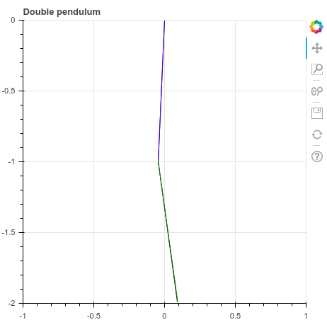

# Deep Controller

@run-time deep controller of simulators

```
python train.py --project_name deep_controller --work_space schattengenie
```


## Comarisons of exact pendulum and approximated pendulum with control network

Without control network two solutions diverge rapidly:



With control network there is an insignificant d:

